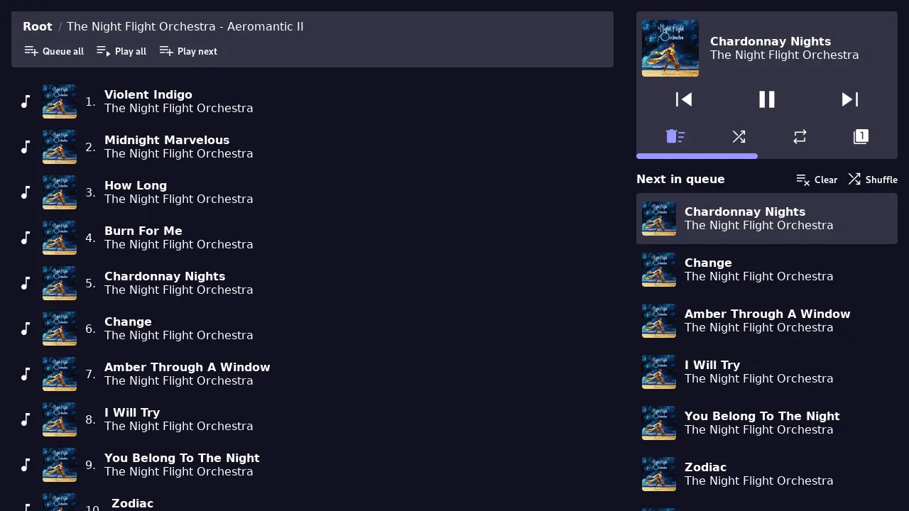

# Empede
**A web client for MPD.**

## Configuration
Empede is configured using environment variables:

| Name            | Default      | Description                       |
| --------------- | ------------ | --------------------------------- |
| **MPD_HOST**    | localhost    | MPD server host                   |
| **MPD_PORT**    | 6600         | MPD server port                   |
| **EMPEDE_BIND** | 0.0.0.0:8080 | Address for Empede to bind to     |

## Running
### Linux
1. Download and extract the [latest release](https://git.sijman.nl/_/empede/releases)
2. Run `./empede` (To specify a host and port, run `MPD_HOST=ip MPD_PORT=6600 ./empede`)
3. Go to http://localhost:8080

### Windows
1. Download and extract the [latest release](https://git.sijman.nl/_/empede/releases)
3. Run `.\empede` in a PowerShell (To specify a host and port, first set the `$env:MPD_HOST` and `$env:MPD_PORT` variables)
3. Go to http://localhost:8080

### Building from source
1. Make sure Rust is installed (https://rustup.rs/)
2. Run `cargo run` (To specify a host and port, run `MPD_HOST=ip MPD_PORT=6600 cargo run`)
3. Go to http://localhost:8080
